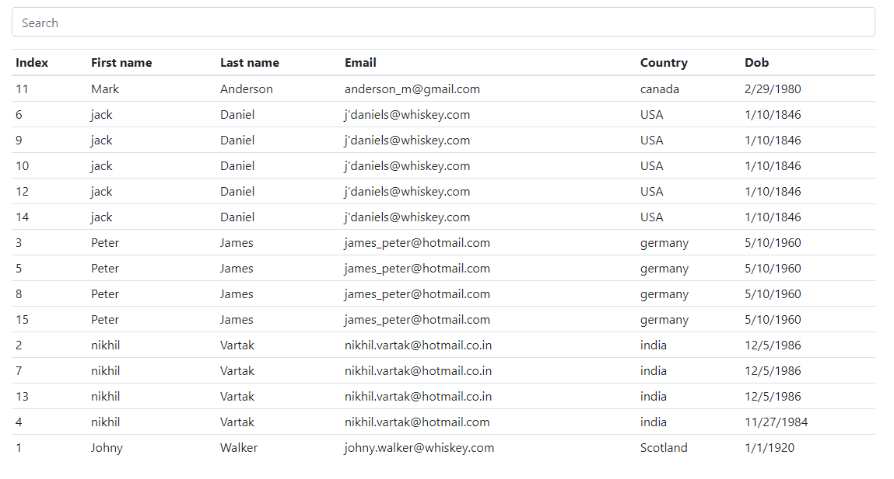

<!-- PROJECT LOGO -->
<br />
<p align="center">
<a href="https://www.ryanrickgauer.com/blog/entries.php?entryID=37">

</a>

<h3 align="center">Auto Tables</h3>
<p align="center">My personal JavaScript library for sorting and searching tables.</p>
<p align="center"><strong><i><a href="https://www.ryanrickgauer.com/blog/entries.php?entryID=37">View Demo</a></i></strong></p>


<details open>
<summary><b>Table of Contents</b></summary>

<p></p>

1. [About the Project](#about-the-project)
    1. [Built With](#built-with)
1. [Getting Started](#getting-started)
    1. [Prerequisites](#prerequisites)
1. [Usage](#usage)
1. [Contributing](#contributing)
1. [Contact](#contact)

</details>

<!-- ABOUT THE PROJECT -->
## About The Project



For some time, I have been using other people's libraries to sort and search an html table. So I decided to make my own library for myself and others.

This library allows you to:
* Sort an html table by clicking on the table header row
* Search an html table by typing in a keyword into a text input

### Built With

* [JQuery](https://jquery.com)


<!-- GETTING STARTED -->
## Getting Started

### Prerequisites

Before you include the script in your project, **you must include jQuery**.

```html
<script src="https://ajax.googleapis.com/ajax/libs/jquery/3.5.1/jquery.min.js"></script>
```

Then, after downloading the [auto-tables.js](https://github.com/rrickgauer/auto-tables/blob/master/auto-tables.js) script, include it in your html file. 

```html
<script src="js/auto-tables.js"></script>
```


## Usage

There are 2 modules that are included in the script: **tablesort** and **tablesearch**.

### Tablesort

To use the tablesort, add the class `tablesort` to your desired table. And for earch table header, add `data-tablesort-type` attribute.

#### Example

```html
<table class="tablesort">
  <thead><tr>
    <th data-tablesort-type="int">Index</th>
    <th data-tablesort-type="string">First name</th>
    <th data-tablesort-type="string">Last name</th>
    <th data-tablesort-type="string">Email</th>
    <th data-tablesort-type="string">Country</th>
    <th data-tablesort-type="date">Dob</th>
  </tr></thead>
</table>
```

As of now, the only accepted `data-tablesort-type` types are:
* **int** - `data-tablesort-type="int"`
* **string** - `data-tablesort-type="string"`
* **date** - `data-tablesort-type="date"`

Dates require a further step that you can read about in our [docs](https://www.ryanrickgauer.com/blog/entries.php?entryID=37).

### Tablesearch

To use the table search feature, you need to have a `table` and an `input[type="text"]`. 

For the table, add the class `tablesearch-table`.


For the text input:

* add the class `tablesearch-input`
* add the attribute `data-tablesearch-table`
  * set the value to the id or classname of the table you want searched

#### Example

```html
<input type="text" class="tablesearch-input" data-tablesearch-table="#data-table">

<table id="data-table" class="tablesearch-table"></table>
```


## Contributing

Contributions are what make the open source community such an amazing place to be learn, inspire, and create. Any contributions you make are **greatly appreciated** :pray:

1. Fork the Project
2. Create your Feature Branch (`git checkout -b feature/AmazingFeature`)
3. Commit your Changes (`git commit -m 'Add some AmazingFeature'`)
4. Push to the Branch (`git push origin feature/AmazingFeature`)
5. Open a Pull Request


## Contact

Written by [Ryan Rickgauer](https://www.ryanrickgauer.com/resume/index.html)


<!-- MARKDOWN LINKS & IMAGES -->
<!-- https://www.markdownguide.org/basic-syntax/#reference-style-links -->
[contributors-shield]: https://img.shields.io/github/contributors/othneildrew/Best-README-Template.svg?style=flat-square
[contributors-url]: https://github.com/othneildrew/Best-README-Template/graphs/contributors
[forks-shield]: https://img.shields.io/github/forks/othneildrew/Best-README-Template.svg?style=flat-square
[forks-url]: https://github.com/othneildrew/Best-README-Template/network/members
[stars-shield]: https://img.shields.io/github/stars/othneildrew/Best-README-Template.svg?style=flat-square
[stars-url]: https://github.com/othneildrew/Best-README-Template/stargazers
[issues-shield]: https://img.shields.io/github/issues/othneildrew/Best-README-Template.svg?style=flat-square
[issues-url]: https://github.com/othneildrew/Best-README-Template/issues
[license-shield]: https://img.shields.io/github/license/othneildrew/Best-README-Template.svg?style=flat-square
[license-url]: https://github.com/othneildrew/Best-README-Template/blob/master/LICENSE.txt
[linkedin-shield]: https://img.shields.io/badge/-LinkedIn-black.svg?style=flat-square&logo=linkedin&colorB=555
[linkedin-url]: https://linkedin.com/in/othneildrew
[product-screenshot]: images/screenshot.png